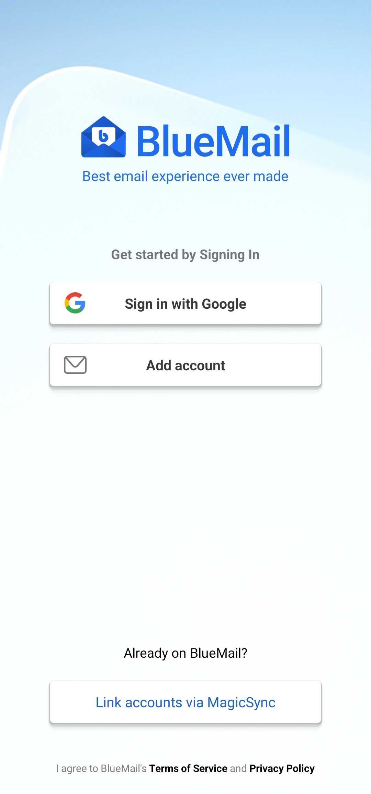
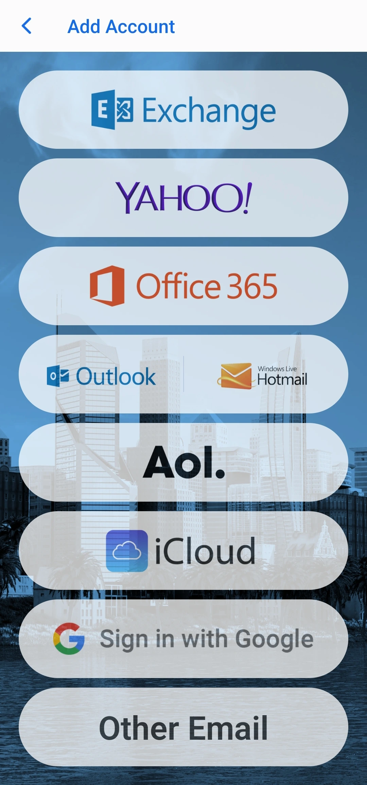
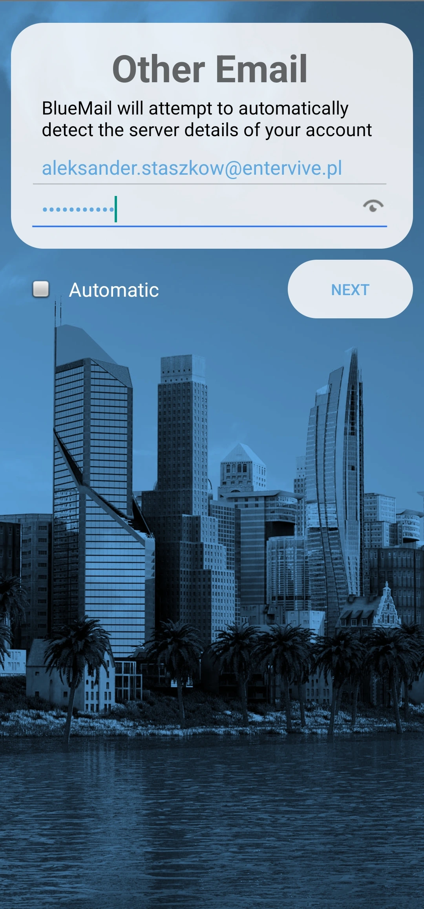
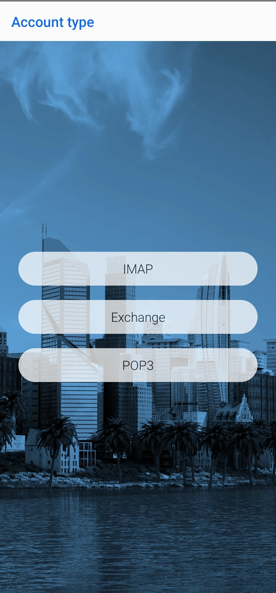
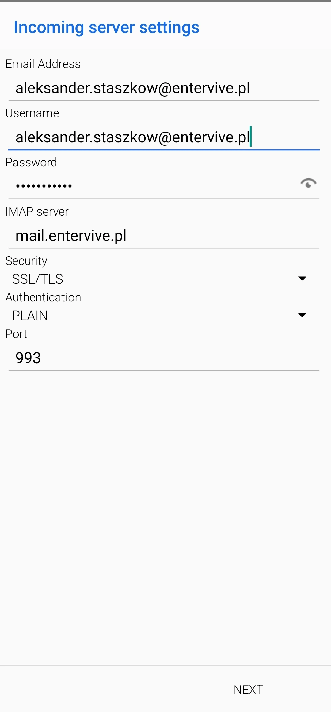
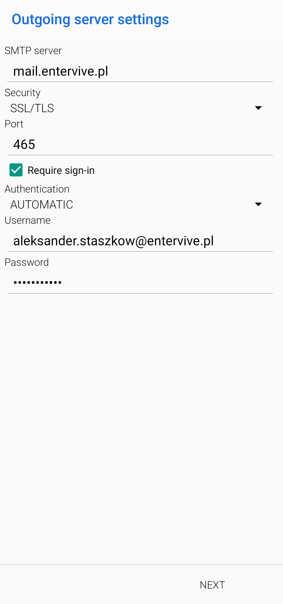
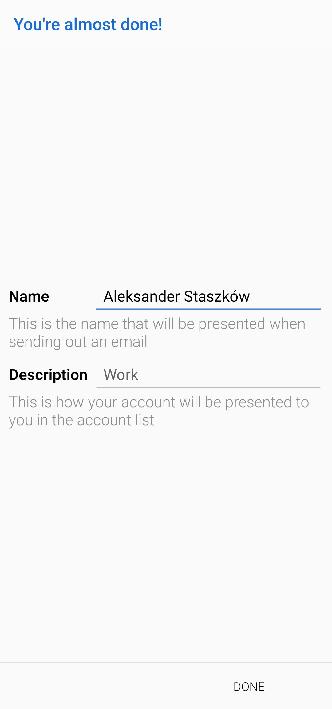
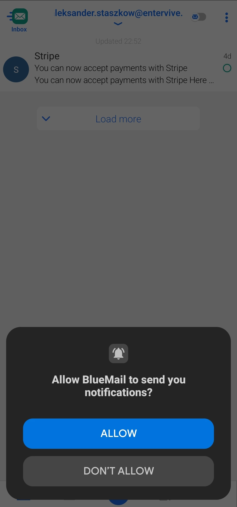

## Logowanie na Androidzie z Thunderbird

1. **Pobierz aplikację Thunderbird:**  
   Pobierz z <a href="https://play.google.com/store/apps/details?id=net.thunderbird.android&referrer=utm_campaign%3Dandroid_website_appeal%26utm_medium%3Dweb%26utm_source%3Dthunderbird.net%26utm_content%3Dlink" target="_blank">Google Play Store</a>.

2. **Uruchom aplikację:**  
   Otwórz Thunderbird i wybierz opcję "Dodaj konto".

3. **Wprowadź dane konta:**  
   Podaj swoje imię, adres e-mail (np. <a href="mailto:twoja.nazwa@edu.entervive.pl" target="_blank">twoja.nazwa@edu.entervive.pl</a>) oraz hasło.

4. **Ustawienia serwera:**  
   Upewnij się, że:

   - **Serwer poczty przychodzącej (IMAP):** mail.entervive.pl  
     (Security: SSL/TLS, Authentication: PLAIN, Port: 993)
   - **Serwer poczty wychodzącej (SMTP):** mail.entervive.pl  
     (Security: SSL/TLS, Port: 465)

5. **Zakończ konfigurację:**  
   Kliknij "Gotowe" lub "Zakończ", aby zakończyć konfigurację.

6. **Wideo instruktażowe:**  
   Poniżej znajduje się film prezentujący cały proces konfiguracji konta w Thunderbird na Androidzie:

   <video controls style="max-width:50%; height:auto;">
      <source src="/docs/mail/filmy/logowanieAndroid.webm" type="video/mp4">
      Twoja przeglądarka nie obsługuje tagu video.
   </video>

---

## Logowanie na Huaweiu i iPhonie

W tej sekcji przedstawiamy konfigurację konta e-mail przy użyciu aplikacji Bluemail, dostępnej zarówno na urządzenia z HarmonyOS (Huawei), jak i na iPhone (iOS). Interfejs Bluemail jest podobny dla obu platform. Poniżej znajdziesz instrukcje krok po kroku wraz z ilustracjami oraz linkami do pobrania aplikacji.

### Pobieranie aplikacji Bluemail

- **Dla iPhone (iOS):**  
  Pobierz Bluemail z <a href="https://apps.apple.com/us/app/blue-mail-email-calendar/id1063729305?platform=iphone" target="_blank">Apple App Store</a>.
- **Dla Huawei (HarmonyOS):**  
  Pobierz Bluemail z <a href="https://appgallery.huawei.com/app/C100838435?sharePrepath=ag&locale=sr_RS&source=appshare&subsource=C100838435" target="_blank">Huawei AppGallery</a>

### Konfiguracja aplikacji Bluemail

1. **Kliknij "Add Account":**  
   

2. **Kliknij "Other Email":**  
   

3. **Wypełnij dane:**  
   Wprowadź swój adres e-mail oraz hasło.  
   

4. **Wyłącz funkcję "Automatic":**  
   Upewnij się, że opcja automatycznej konfiguracji jest wyłączona.  
   

5. **Wybierz protokół IMAP:**  
   Wybierz IMAP jako protokół poczty.  
   

6. **Sprawdź ustawienia serwera przychodzącego:**  
   Upewnij się, że:

   - **IMAP Server:** mail.entervive.pl
   - **Security (SSL/TLS):** (czyli zabezpieczenie, np. SSL/TLS)
   - **Authentication:** PLAIN
   - **Port:** 993  
     

7. **Sprawdź ustawienia serwera wychodzącego:**  
   Upewnij się, że:

   - **SMTP Server:** mail.entervive.pl
   - **Security (SSL/TLS):**
   - **Port:** 465  
      (Pomiń pola Username, Password i Authentication)  
     

8. **Poczekaj na konfigurację:**  
   Poczekaj chwilę, aż aplikacja skonfiguruje konto.  
   

9. **Uzupełnij swoje imię:**  
   Wprowadź imię według własnych potrzeb.  
   

10. **Zezwól na powiadomienia:**  
    Zezwól na powiadomienia, aby nie przegapić ważnych informacji.  
    

---

_Entervive dla Edukacji – skonfiguruj swoje konto e-mail na urządzeniach mobilnych, aby być zawsze w kontakcie!_
